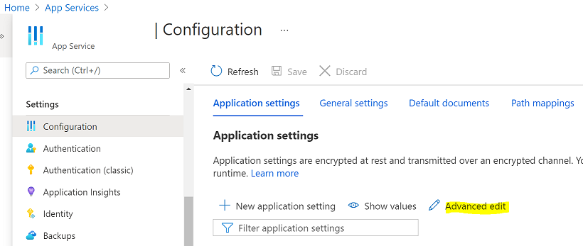

# irCatalog Service with DevOps Features - Azure Deployment

irCatalog® is a business rule management tool that provides centralized management of rules to ensure the integrity of business rules, keep everyone working on the latest version of rules, and promote sharing of common rules across customers, processes or applications.

The DevOps solution requires a number of binaries and configuration parameters to be deployed to the Azure® irCatalog service instance. There are two options for deploying these components:

### Create and configure a new instance of irCatalog app service

* [Database Deployment](ircatalog-azure-db.md)
* [irCatalog Web App Deployment](ircatalog-azure-DevOps.md)
* [Configure DevOps Catalog Service](#configure-catalog-service-with-DevOps)

### Update an existing instance of irCatalog app service

* This option applies if you first [deployed the standard Azure irCatalog App Service](https://github.com/InRule/AzureAppServices).
* [Add DevOps Artifacts](#add-DevOps-artifacts-to-an-existing-catalog-service)
* [Configure DevOps Catalog Service](#configure-catalog-service-with-DevOps)

---
## Add DevOps Artifacts to an Existing Catalog Service

This section applies when deploying only the DevOps add-on to an existing instance of the irCatalog App Service. The steps to configure the Azure app service with the DevOps features are:

* Download [InRule.Catalog.Service_DevOps.zip](../releases/InRule.Catalog.Service_DevOps.zip) and unzip in a folder on the local file system.
* Copy the content of the bin folder to the existing bin folder in App Service Editor. Accept to overwrite files, if prompted.

---
## Configure Catalog Service with DevOps

This section applies to both deployment options: new irCatalog service with DevOps or existing irCatalog service. Once either app service was created and the binaries deployed or updated, the configuration must be updated using [Azure portal](https://portal.azure.com): 
* Download the starter configuration file [InRule.Catalog.Service_DevOps.config.json](../config/InRule.Catalog.Service_DevOps.config.json) and save it to the local file system. Edit the values for *AesEncryptDecryptKey* and *ApiKeyAuthentication.ApiKey* to match the values set on the InRule DevOps service.

|Configuration Key | Comments
--- | ---
|**ApiKeyAuthentication.ApiKey**| A string added to the authorization header on the request made by the listener component to the DevOps service. The value can be any string and we recommend using randomly generated GUID values. For on-premise deployments, this parameter is not used.   Used for both the client and server components. For a pair of catalog and DevOps services that are set to work together, **this parameter must be set to the same value on both services**.
|**AesEncryptDecryptKey**| A string value used for symmetric encryption/decryption of the payload sent by the catalog listener component to the DevOps service. It must be between 16 and 32 characters long, with a combination of letters and numbers. For on-premise deployments, this parameter is not used.   Used for both the client and server components. For a pair of catalog and DevOps services that are set to work together, **this parameter must be set to the same value on both services**.
|**ApprovalFlow.ApplyLabelApprover**| The user designated as label assignment approver. If this user attempts to assign a label, it will be accepted directly.  If a different user attempts the same, [the approval flow](ApprovalFlow.md) will kick in.
|**InRuleDevOpsServiceUri**| Complete URL for the DevOps service, where event data are sent and processed. For on-premise deployments, this parameter is not used. Used only for the client component.
|**FilterEventsByUser**| List of space separated catalog user names.  This value is empty by default, meaning that events from all catalog users will be intercepted by DevOps.  If usernames are listed here, the DevOps solution will only react to events triggered by these users. Used for both the client and server components.
* In Azure portal, navigate to the App Service Editor:

    
* Open the bulk configuration editor, by clicking "Advanced edit", and merge the items in the file downloaded and edited before.  You must maintain the validity of the JSON array content, following the format in the two files to merge only the new configuration entries:

    
* Click Save and agree with the action that restarts the app service:

    
* Restart the app service and confirm that the irCatalog service works properly: browse to the URL in browser, open a rule application in irAuthor.

* If the InRule DevOps App Service was created before the creation of the irCatalog App Service, it is necessary to update the DevOps App Service configuration with the credentials required for accessing irCatalog App Service. This can be done by navigating to the DevOps App Service in [Azure portal](https://portal.azure.com) and setting the value of the CatalogUsername and CatalogPassword parameters. Make sure to include "/Service.svc/api", like in the example below.  Saving the configuration and restarting the irCatalog App Service are required.

    ```
    {
        "name": "CatalogPassword",
        "value": "",
        "slotSetting": false
    },
    {
        "name": "CatalogUsername",
        "value": "admin",
        "slotSetting": false
    }
    ```

---
### Verify using irAuthor®
Using irAuthor you should now be able to connect to your catalog using the url [https://WEB_APP_NAME.azurewebsites.net/service.svc](https://WEB_APP_NAME.azurewebsites.net/service.svc).
